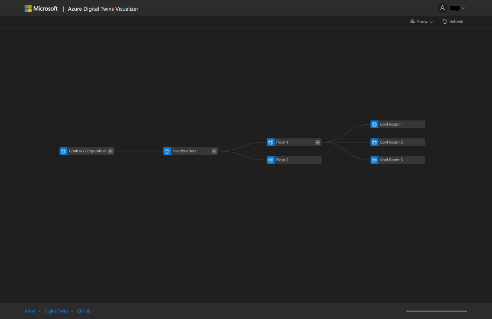

## Introduction
This "Digital Twins Model Visualizer" serves as a front-end to the [Azure Digital Twins](https://azure.microsoft.com/en-us/services/digital-twins/) spacial intelligence graph. It provides the following features:
- Visualizing the relationship between spaces, devices and sensors created in the Digital Twins model
- Changing the hierarchy by moving devices and spaces to different spaces
- View basic properties and values of nodes

The visualizer is built to be a lightweight, adaptable front-end. It uses only client-side code and as such should be easy to deploy in different environments. 

## Setup instructions

### Prerequisites
Before using the visualizer, make sure that your deployment of Azure Digital Twins is complete. You will need to perform at least the following steps:
- Deploy a DigitalTwins instance to your Azure subscription.
- Create a root space in your topology. Under the samples directory, you can find an [example topology](samples/sample-topology.json) that you could use. 

For detailed instructions, please refer to the [Digital Twins getting started guide](https://docs.microsoft.com/en-us/azure/digital-twins/tutorial-facilities-setup)

### Creating an Azure AD application
In order to connect to Digital Twins, the visualizer tool must be registered in Azure Active Directory. 

1. Navigate to the Azure Active Directory page in the Azure portal.
2. Create a new application. Be sure to select Web/API and enter the exact URL you will deploy the visualizer to.   

3. After creation, take note of the Application ID guid. You will need that later.
4. Go to Settings / Permissions and select the Azure Digital Twins service from the API list. Specify 'Read/Write Access' as the required permission. 

5. Confirm the screen and click 'Grant permissions'.
6. Click the 'Edit Manifest' button. In the manifest, change the value for the 'oauth2AllowImplicitFlow' setting to 'true' and save.  

### Prepare files
- Clone or download the repository files to your computer. 
- Open index.html in your favorite editor and go to the script block at the top of the page. Update the values for the three variables:
    - twinsInstanceRoot: This is the full URL of your Digital Twins instance, ending in azuresmartspaces.net/.
    - tenant: This is the name of your Azure tenant, for example contoso.onmicrosoft.com
    - clientId: This is the application id of the Azure Active Directory application you created in the previous step. It is formatted as a Guid.

### Deploy
Upload the files you've prepared in the previous step to your webserver. For example, you could create an Azure web app and deploy using FTP or VSTS. Alternatively, you could run this off a localhost webserver. Just make sure the reply-url in the AzureAD application has been set to the appropriate URL.
Running this locally by opening the files is not supported, since the login redirect from AzureAD would fail.

After deploying, you should be able to navigate to your deployment and sign in to the visualizer.

