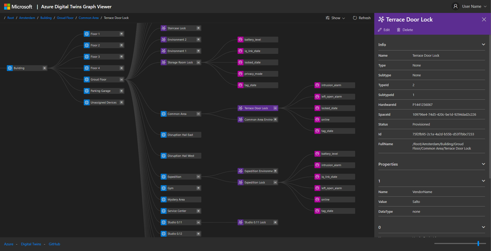
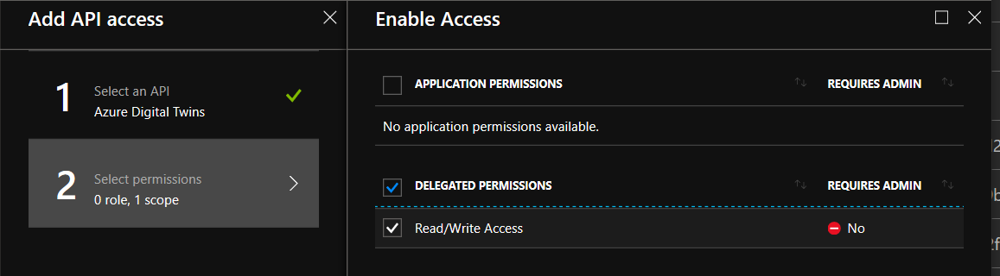
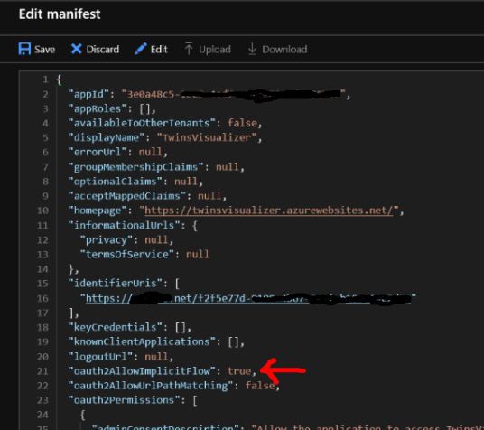

# Introduction
This "Azure Digital Twins Graph Viewer" serves as a front-end to the [Azure Digital Twins](https://azure.microsoft.com/en-us/services/digital-twins/) spatial intelligence graph. It provides the following features:
- Visualizing the relationship between spaces, devices and sensors created in the Azure Digital Twins model
- Add, Edit and Delete Spaces and Devices
- Changing the hierarchy by moving devices and spaces to different spaces
- Viewing basic properties and values of nodes

The Graph Viewer is built to be a lightweight, adaptable front-end. It uses only client-side code and as such should be easy to deploy in different environments. 

# Setup instructions

## Prerequisites
Before using the Graph Viewer, make sure that your deployment of Azure Digital Twins is complete. You will need to perform at least the following steps:
- Deploy an Azure Digital Twins instance to your Azure subscription.
- Create a root space in your topology. Under the samples directory, you can find an [example topology](samples/sample-topology.json) that you could use. 

For detailed instructions, please refer to the [Azure Digital Twins quick start guide](https://docs.microsoft.com/en-us/azure/digital-twins/tutorial-facilities-setup)

## Creating an Azure AD application
In order to connect to Azure Digital Twins, the Graph Viewer must be registered in Azure Active Directory. 

1. Navigate to the Azure Active Directory page in the Azure portal.
2. Create a new application. Be sure to select Web/API and enter the exact URL you will deploy the Graph Viewer to.   

3. After creation, take note of the Application ID guid. You will need that later.  
4. Go to Settings / Permissions and select the Azure Digital Twins service from the API list. Specify 'Read/Write Access' as the required permission. 

5. Confirm the screen and click 'Grant permissions.'  
6. Click the 'Edit Manifest' button. In the manifest, change the value for the 'oauth2AllowImplicitFlow' setting to 'true' and save.  

## Prepare files
- Clone or download the repository files to your computer. 
- Open index.html in your favorite editor and go to the script block at the top of the page. Update the values for the three variables:
    - twinsInstanceRoot: This is the full URL of your Azure Digital Twins instance, ending in `azuresmartspaces.net/`.
    - tenant: This is the name of your Azure tenant, for example `contoso.onmicrosoft.com`
    - clientId: This is the application id of the Azure Active Directory application you created in the previous step. It is formatted as a Guid.

## Deploy
Upload the files you've prepared in the previous step to your webserver. For example, you could create an Azure web app and deploy using FTP or VSTS. Alternatively, you could run this off a localhost webserver. Just make sure the reply-url in the AzureAD application has been set to the appropriate URL.
Running this locally by opening the files is not supported, since the login redirect from AzureAD would fail.

After deploying, you should be able to navigate to your deployment and sign in to the Graph Viewer.

## Known Limitations
### Public Preview Limitations of max number of objects.
During the public preview of Azure Digital Twins, certain service limits are in place. These are described in the [documentation](https://docs.microsoft.com/en-us/azure/digital-twins/concepts-service-limits). One of these limits is that the API calls to the /devices, /spaces and  /sensors endpoints will not return more than 1000 objects. In the graph viewer, objects over that limit will not be returned. Future versions will handle this based on the limits on Digital Twins at GA time.
### Not able to add new devices and sensors
The current version does not allow you to create a device or a sensors. Functionality for devices and sensors is limited to editting and deleting. 

# Contributing

This project welcomes contributions and suggestions.  Most contributions require you to agree to a
Contributor License Agreement (CLA) declaring that you have the right to, and actually do, grant us
the rights to use your contribution. For details, visit https://cla.microsoft.com.

When you submit a pull request, a CLA-bot will automatically determine whether you need to provide
a CLA and decorate the PR appropriately (e.g., label, comment). Simply follow the instructions
provided by the bot. You will only need to do this once across all repos using our CLA.

This project has adopted the [Microsoft Open Source Code of Conduct](https://opensource.microsoft.com/codeofconduct/).
For more information see the [Code of Conduct FAQ](https://opensource.microsoft.com/codeofconduct/faq/) or
contact [opencode@microsoft.com](mailto:opencode@microsoft.com) with any additional questions or comments.

## Contributors

Joost ten Kattelaar 
Niels Buit
